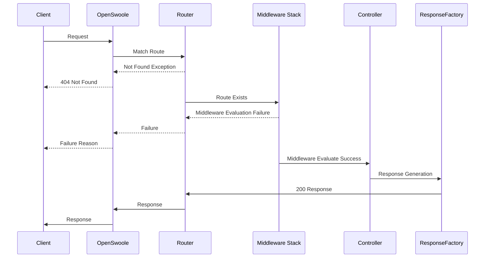

# Intro
This is a boilerplate for creating APIs using OpenSwoole and a few other libraries, it is NOT  a framework (yet). It uses [Opis Schema](https://opis.io/json-schema/) for request validation, [PHP League Route](https://route.thephpleague.com/) for Routing and [OpenSwoole](https://openswoole.com/) as the server and [PHP-DI](https://php-di.org/) as dependency container along with other libraries for project specific functionality.

> This is still work in progress :)

## Features

- Async Events
- PSR Request and Response
- Dependency Container
- JSON Schema based input validation

## Getting Started
#### Prerequisites

1. PHP 8.x
2. OpenSwoole Extension - [How do I install this?](https://openswoole.com/docs/get-started/installation)
3. Composer


#### Setting Up
1. Clone the repository.
2. In the project root run `composer install`
3. Change the JWT key in /config.php
4. Once, everything is installed, in the root directory run `php server.php`

You should see an output similar to this :
```
- Building Container
- Registering Middlewares
- Registering Routers
- Creating Events Table
- Starting Events Processor
- Registering Event Listeners
- Server Started on interface: 127.0.0.1, Port: 5023
```
Open the URL in the browser : http://127.0.0.1:5023

You should get a response similar to this :
```json
{
  "status": "Success",
  "data": {
    "hello": "world"
  },
  "debug": {
    "memory": {
      "mem_usage": 3703,
      "mem_peak_usage": 3748
    }
  }
}
```
---
### Understanding Code Structure

#### Folder Structure
```
.
├── composer.json
├── composer.lock
├── config.php
├── logs	----> 
│   └── application.log
├── server.php 
├── src
│   ├── Controllers  
│   ├── Core  
│   ├── EventListeners 
│   ├── Middlewares 
│   ├── Registrations.php
│   ├── Routers
│   ├── Schemas
│   └── Services
└── vendor
```
#### server.php
`server.php` is  the entry point and the listener, it basically creates an instance of `src/Core/App.php` which is the bootstrap file. It first configures the app ( registers the dependencies, controllers and event listeners ) and then starts listening on specified port and interface ( mentioned in `config.php` )

#### config.php
This holds constants, some are required for the boilerplate to function, such as port, debug mode etc. other parameters are specific to the project, you may add your own constants within the same file.

#### src/Registrations.php
This boiler plate uses PHP-DI as dependency container, there may be situations where you would want to configure your services/libraries before being injected, this file is exactly for that purpose. The Class has one function `getContainerDefinitions`which returns an associative array [ Acme::class => callable() ]. The callable function should return the configured object of the service you're registering.

As an example, the file already contains a registration of Monolog, to add your definitions, simply extend the returning array and add your definitions

## How to

#### Add Routes
I've personally never liked the idea of having all the routes in a single class, therefore this boilerplate supports multiple routing files, this way you can segregate the endpoints based on their use, or perhaps based on other factors. It just makes the code more organized.

To add a new router:

1. Create a new Class in `src/Routers` that implements `Shahzaib\Framework\Core\Contracts\Router`
2. Implement the method stubs
3. Start adding your routes in the __construct() function, consider the following code

```php
public function __construct(MyRouter $router)  
{  
    $router->map('GET', '/', [\Shahzaib\Framework\Controllers\Demo::class,'Index']);
}
```
For more information and options when adding routes, look at the demo routes in `src/Routers/Demo.php`
Also view [PHP-League Route](https://route.thephpleague.com/5.x/)

---
#### Add Controllers
Controllers can be added anywhere since they are lazy loaded when a route matches the request, There are multiple ways of creating them, as an example look at  `src/Controllers/Demo.php`also read [PHP-League Route - Controllers](https://route.thephpleague.com/5.x/controllers/)

---
#### Add Middlewares
Creating Middleware is as simple as creating a class and implementing `Psr\Http\Server\MiddlewareInterface`
A middleware can either be global ( triggered for every request ) or route specific ( triggered for specific routes )

To create a global middleware, simply place your middleware class in `src/Middlewares` and restart the `server.php`, All the middlewares in `src/Middlewares` are automatically chained during boot on all the routes

To create a route specific middleware, place your middleware class in src/Services or create a new folder and place it there, then link the middleware on a specific route :

```php
$router->map('GET', '/', [\Shahzaib\Framework\Controllers\Demo::class,'Index'])->middleware(YOUR_MIDDLEWARE_CLASS:class);
```
As an example, a global middleware is located at `src/Middleware/Authentication.php`

---
### JSON Schema and Validations
Validating user input within the controllers or middlewares is something I've never liked, bunch of if conditions, hardcoded regex don't look great, neither are easily scalable, this project uses [Opis JSON Schema](https://opis.io/json-schema/), this allows defining JSON schema for validation of data input. The validation is performed through a middleware that is always chained globally during boot, so you don't have to configure anything. Each route can either have its own JSON document that defines the input data schema, OR it can use a common schema, whatever fits the requirements.

` const SCHEMA_VALIDATION_RQST_METHODS ` defined in `config.php` controls which request methods should be validated against a schema, by default they are PUT, POST, PATCH

#### Adding Your Schema
To add a schema for an endpoint/route, follow these steps:

1. Create your JSON schema, and save it in `src/Schemas`
2. Add the schema to an endpoint by invoking `->setSchema(schema_name)`:

```php
$router->map('POST','/some_path', [\Shahzaib\Framework\Controllers\Demo::class,'SomeCallback'])->setSchema("dummy_schema");
```

As an example, the project already contains a dummy_schema.

---

### Async Events
Async are events that are fired within the code and are observed and executed without blocking the request. Think of writing a log every time a request is made, under a normal NGINX/Apache, the request is blocked until everything in that request is completed which also includes any events that are fired, essentially everything is executed in a linear fashion.

This project utilizes [Swoole Tables](https://openswoole.com/docs/modules/swoole-table) which are in-memory storage tables, and [Swoole Timer](https://openswoole.com/docs/modules/swoole-timer) to register, observe and dispatch events.

Under the hood this is what happens :

1. During boot, Events are registered and a table is created in memory
2. When events are dispatched, their name and payload are stored in the table
3. A timer runs in a separate thread that reads the table and executes the callables, passing the payload as argument
4. Processed records are deleted from the table

Event Registration, and execution is handled using `/src/Core/Services/AsyncEventService`

---

#### Adding your own event listeners

1. Create a new Class in `src/EventListeners`
2. Register all your events in the __construct() method using ` Shahzaib\Framework\Core\Services\AsyncEventService` class

As an example, an event listener is already present in the `src/EventListeners` directory

---

#### Dispatching Events
Events can be dispatched anywhere in the code by using AsyncEventService class

```php
$asyncEventService->dispatchEvent(YOUR_EVENT_NAME,$PAYLOAD);
```

## Caution - Memory Leaks
In a typical PHP application served using Nginx/Apache, the objects created during a request are limited in scope to that request, once a request terminates, everythig related to that request is destroyed too, this reduces the risks of memory leaks. When using Swoole, Objects that are created remain in the memory unless explicitly destroyed. This behaviour negatively impacts the dependency injection since most dependency containers including PHP-DI work in a singleton configuration by default.

To solve this problem for classes that are considered stateless in context of a request, instead of injecting the dependencies via constructor, you should inject the DI factory interface and create a new instance to avoid memory leaks.

Consider a Class : Acme, assume it holds information related to the authentication token, hence the scope is supposed to be limited to the request.

Don't do this :

```php
pubic function __construct(\Acme $acme)
{
$this->acme = $acme;

if(!$this->acme->getToken())
$this->acme->setToken("some_value");

}
```
Explanation : \Acme::class is initialized once, any properties that are set once would remain set and the subsequent request would use the same object creating memory leaks, in this specific example, the very first request would set the token, because getToken() would return TRUE, subsequent requests would not set the token since it was already set in the first request

Do this :

```php
public function __construct(\DI\FactoryInterface $factory)
{
$this->acme = $factory->make(Acme::class, [ ... ]);
...
}
```
Explanation : We create a new object of \Acme::class instead of injecting, this ensures a new object everytime a request is processed

PHP-DI version < 6 did provide an option called 'scopes'[https://php-di.org/doc/scopes.html] which would potentially inject a new instance everytime, however this functionality has been deprecated.


### Request Execution Flow


